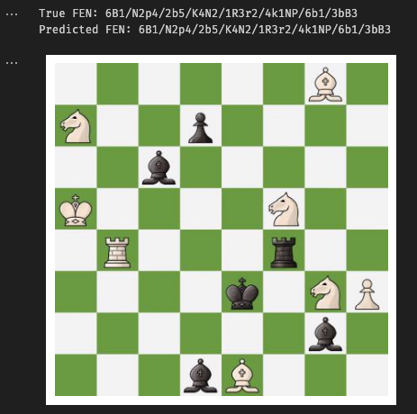

# Chessboard FEN Predictor

This project is my attempt at generating a FEN representation from arbitrary images of virtual chess boards. 

The `training.ipynb` notebook includes my exploration of the data, training of the model, and final testing results. The high-level approach taken was:
* I used the [Chess Positions](https://www.kaggle.com/datasets/koryakinp/chess-positions/data) dataset from Kaggle. This includes a large training set of images of chess boards with pieces in various positions.
* OpenCV and Python are used to read these images and divide them into squares
* Squares are labelled with the piece they contain, or 0 if they do not contain a piece
* PyTorch to create a CNN-based model to classify each square's image


The model is small so inference is fast. It was able to correctly classify 100% of the boards sampled from the testing dataset.

The model works for arbitrary styled chess boards and pieces:

```python
sample = random.choice(testing_images)

img = cv2.imread(sample)
fen = get_image_fen(sample)
predicted_fen = infer_image(sample)

print("True FEN:", fen)
print("Predicted FEN:", predicted_fen)
plt.imshow(cv2.cvtColor(img, cv2.COLOR_BGR2RGB))
plt.axis("off")
plt.show()
```

